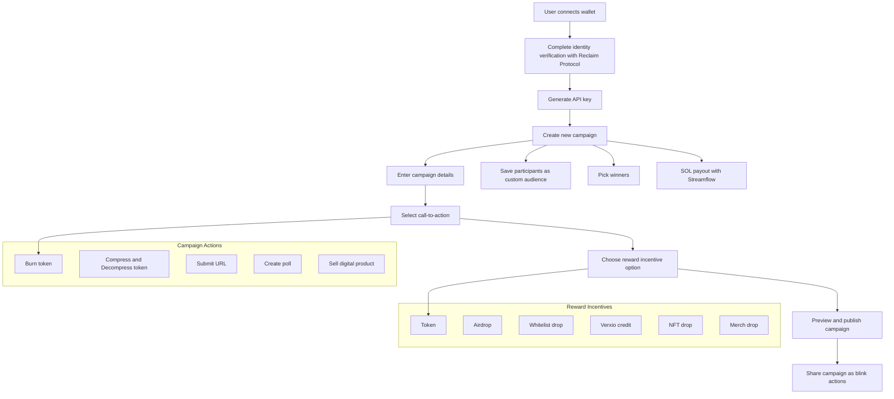

Ads creator for web3 developers and brands

<h3>
   
[API Docs](https://documenter.getpostman.com/view/22416364/2sA3kaCeiH) | [Website](https://www.verxio.xyz/) | [Demo Video](https://youtu.be/qNdvqlxM6b8)

</h3>

<h1 align="center">OVERVIEW</h1>
The Verxio Protocol backend provides the core services and APIs that enable developers and brands to create interactive, tokenized ads (blinks) and campaigns. These APIs support wallet integrations, identity verification, campaign creation, and reward distribution through our integration with protocols like Streamflow, Reclaim, and Light Protocol.

## 📖 Protocol Architecture

## 🛠 Workflow

1. First, the user creates a new profile by connecting their wallet.
   They should complete their identity verification with Reclaim Protocol before they can participate in campaigns or create campaigns.
2. Then the user can now generate an API key for creating and managing campaigns
3. The user can create a new campaign, save participants as a custom audience, pick winners, and SOL payout for reward distribution with Streamflow.
4. Finally, the user can share their campaign call-to-action as blink actions.

## 🪛 Integration

[streamflow-stream](https://docs.streamflow.finance/en/articles/9675301-javascript-sdk) - Interact with the protocol to create streams and vesting contracts. Token reward payout to the winner is initiated with Streamflow.

[reclaim-protocol](https://www.reclaimprotocol.org/) - used for ZkProof identification to prevent spam, and bots and ensure real human interactions.

[light-protocol](https://lightprotocol.com/) - Used the compression APIs to create several ad campaign templates.

## 🌐 Repo URLs

- [Verxio Backend Endpoints](https://github.com/Axio-Lab/verxioprotocol/tree/main/Verxio)
- [Verxio Actions](https://github.com/Axio-Lab/verxioprotocol/tree/main/VerxioActions)
- [Verxio Client](https://github.com/Axio-Lab/verxio-lite)