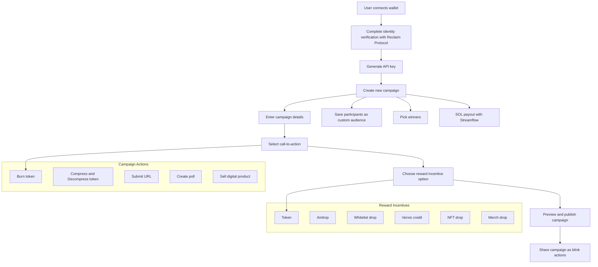

Ads creator for web3 developers and brands

<h3>
   
[API Docs](https://documenter.getpostman.com/view/22416364/2sA3kaCeiH) | [Website](https://www.verxio.xyz/) | [Demo Video](https://youtu.be/qNdvqlxM6b8)

</h3>

<h1 align="center">OVERVIEW</h1>
The Verxio Protocol backend provides the core services and APIs that enable developers and brands to create interactive, tokenized ads (blinks) and campaigns. These APIs support wallet integrations, identity verification, campaign creation, and reward distribution through our integration with protocols like Streamflow, Reclaim, and Light Protocol.

## 📖 Protocol Architecture

## 🛠 Workflow

1. First, the user creates a new profile by connecting their wallet.
   They should complete their identity verification with Reclaim Protocol before they can participate in campaigns or create campaigns.
2. Then the user can now generate an API key for creating and managing campaigns
3. The user can create a new campaign, save participants as a custom audience, pick winners, and SOL payout for reward distribution with Streamflow.
4. Finally, the user can share their campaign call-to-action as blink actions.

## 🪛 Integration

[streamflow-stream](https://docs.streamflow.finance/en/articles/9675301-javascript-sdk) - Interact with the protocol to create streams and vesting contracts. Token reward payout to the winner is initiated with Streamflow.

[reclaim-protocol](https://www.reclaimprotocol.org/) - used for ZkProof identification to prevent spam, and bots and ensure real human interactions.

[light-protocol](https://lightprotocol.com/) - Used the compression APIs to create several ad campaign templates.

## 🌐 Repo URLs

- [Verxio Backend Endpoints](https://github.com/Axio-Lab/verxioprotocol/tree/main/Verxio)
- [Verxio Actions](https://github.com/Axio-Lab/verxioprotocol/tree/main/VerxioActions)
- [Verxio Client](https://github.com/Axio-Lab/verxio-lite)

<h2>API Endpoints</h2>
<h2>Authentication</h2>

To access authenticated routes, include an API key in the request headers using the <code>X-API-Key</code> key. The <code>authenticate</code> middleware verifies the API key as follows:

<ol>
    <li>If the API key is missing, a <strong>401 Unauthorized</strong> response is returned.</li>
    <li>If the API key is invalid, a <strong>404 Not Found</strong> response is returned.</li>
    <li>If valid, the associated user is retrieved and attached to the request object.</li>
    <li>On unexpected errors, a <strong>500 Internal Server Error</strong> response is returned.</li>
</ol>

Ensure your API keys are securely stored within your codebase.

<h3>1. Generate API Key</h3>
<ul>
  <li><strong>Method:</strong> POST</li>
  <li><strong>Endpoint:</strong> <code>/api/v1/:userId</code></li>
  <li><strong>Description:</strong> Generates a new API key for the specified user.</li>
  <li><strong>Request Parameters:</strong>
    <ul>
      <li><code>userId</code> (URL param) - The unique wallet address of the user.</li>
    </ul>
  </li>
  <li><strong>Response:</strong> API key generation confirmation.</li>
</ul>

<h3>2. Invalidate API Key</h3>
<ul>
  <li><strong>Method:</strong> PATCH</li>
  <li><strong>Endpoint:</strong> <code>/api/v1/:userId</code></li>
  <li><strong>Description:</strong> Invalidates an existing API key for the specified user.</li>
  <li><strong>Request Parameters:</strong>
    <ul>
      <li><code>userId</code> (URL param) - The unique wallet address of the user.</li>
    </ul>
  </li>
  <li><strong>Response:</strong> Confirmation of API key invalidation.</li>
</ul>

<h3>3. Create a Campaign</h3>
<ul>
  <li><strong>Method:</strong> POST</li>
  <li><strong>Endpoint:</strong> <code>/api/v1/</code></li>
  <li><strong>Description:</strong> Creates a new campaign. Requires user authentication.</li>
  <li><strong>Request Body:</strong> Campaign data.</li>
  <li><strong>Schema Structure:</strong>
    <ul>
      <li><strong>campaignInfo</strong> (Object, Required): Contains basic information about the campaign.
        <ul>
          <li><strong>title</strong> (String, Required): The title of the campaign.</li>
          <li><strong>start</strong> (String, Required): The start date of the campaign.</li>
          <li><strong>end</strong> (String, Required): The end date of the campaign.</li>
          <li><strong>description</strong> (String, Required): A brief description of the campaign.</li>
          <li><strong>banner</strong> (String, Required): A URL or path to the banner image for the campaign.</li>
        </ul>
      </li>
      <li><strong>action</strong> (Object, Required): Specifies the action associated with the campaign.
        <ul>
          <li><strong>fields</strong> (Object, Required): Specific fields required based on the actionType.
            <ul>
              <li><strong>If actionType is 'Burn-Token', 'Compress-Token', or 'Decompress-Token':</strong>
                <ul>
                  <li><strong>address</strong>: Must be a non-empty string.</li>
                  <li><strong>minAmount</strong>: Must be a number.</li>
                </ul>
              </li>
              <li><strong>If actionType is 'Poll':</strong>
                <ul>
                  <li><strong>title</strong>: Must be a non-empty string.</li>
                  <li><strong>options</strong>: Must be an array with at least one element.</li>
                </ul>
              </li>
              <li><strong>If actionType is 'Submit-Url':</strong> Field is not required.</li>
              <li><strong>If actionType is 'Sell-Product':</strong>
                <ul>
                  <li><strong>product</strong>: Must be a string, represents the product the user wishes to sell.</li>
                  <li><strong>amount</strong>: Must be a number.</li>
                  <li><strong>quantity</strong>: Must be a number.</li>
                </ul>
              </li>
            </ul>
          </li>
        </ul>
      </li>
      <li><strong>rewardInfo</strong> (Object, Required): Information regarding the rewards for the campaign participants.
        <ul>
          <li><strong>noOfPeople</strong> (Number, Required): The number of participants eligible for rewards.</li>
          <li><strong>type</strong> (String, Required): Valid Values: 'Token', 'Verxio-XP', 'Whitelist-Spot', 'Airdrop', 'NFT-Drop', 'Merch-Drop'</li>
          <li><strong>amount</strong> (Number, Conditionally required): The amount of the reward. Required only if type is 'Token' or 'Verxio-XP'.</li>
        </ul>
      </li>
      <li><strong>metaData</strong> (Object, Optional): Optional metadata for additional campaign details.</li>
    </ul>
</li>
  <li><strong>Response:</strong> Campaign creation confirmation.</li>
</ul>

<h3>4. Pay Winners</h3>
<ul>
  <li><strong>Method:</strong> POST</li>
  <li><strong>Endpoint:</strong> <code>/api/v1/pay/:campaignId</code></li>
  <li><strong>Description:</strong> Processes payments for winners in a campaign which can only be initiated by the campaign creator.</li>
  <li><strong>Request Parameters:</strong>
    <ul>
      <li><code>campaignId</code> (URL param) - The unique ID of the campaign.</li>
    </ul>
  </li>
  <li><strong>Response:</strong> Payment transaction details.</li>
</ul>

<h3>5. View All Campaigns</h3>
<ul>
  <li><strong>Method:</strong> GET</li>
  <li><strong>Endpoint:</strong> <code>/api/v1/all</code></li>
  <li><strong>Description:</strong> Retrieves all available campaigns.</li>
  <li><strong>Query Parameters:</strong>
    <ul>
      <li><strong>actionType</strong> (String, Optional): The type of action to be performed in the campaign. Valid Values: 'Burn-Token', 'Compress-Token', 'Decompress-Token', 'Poll', 'Submit-Url', 'Sell-Product'</li>
      <li><strong>status</strong> (String, Optional): The current status of the campaign.</li>
      <li><strong>rewards</strong> (String, Optional): Specifies the type of rewards offered in the campaign.</li>
    </ul>
  </li>
  <li><strong>Response:</strong> List of all campaigns.</li>
</ul>

<h3>6. View Developer's Campaigns</h3>
<ul>
  <li><strong>Method:</strong> GET</li>
  <li><strong>Endpoint:</strong> <code>/api/v1/</code></li>
  <li><strong>Description:</strong> Retrieves campaigns created by the authenticated developer.</li>
    <li><strong>Query Parameters:</strong>
    <ul>
      <li><strong>actionType</strong> (String, Optional): The type of action to be performed in the campaign. Valid Values: 'Burn-Token', 'Compress-Token', 'Decompress-Token', 'Poll', 'Submit-Url', 'Sell-Product'</li>
      <li><strong>status</strong> (String, Optional): The current status of the campaign.</li>
      <li><strong>rewards</strong> (String, Optional): Specifies the type of rewards offered in the campaign.</li>
    </ul>
  </li>
  <li><strong>Response:</strong> List of developer's campaigns.</li>
</ul>

<h3>7. View a Campaign</h3>
<ul>
  <li><strong>Method:</strong> GET</li>
  <li><strong>Endpoint:</strong> <code>/api/v1/:campaignId</code></li>
  <li><strong>Description:</strong> Retrieves details of a specific campaign.</li>
  <li><strong>Request Parameters:</strong>
    <ul>
      <li><code>campaignId</code> (URL param) - The unique ID of the campaign.</li>
    </ul>
  </li>
  <li><strong>Response:</strong> Campaign details.</li>
</ul>

<h3>8. Verify User</h3>
<ul>
  <li><strong>Method:</strong> POST</li>
  <li><strong>Endpoint:</strong> <code>/api/v1/verify-user</code></li>
  <li><strong>Description:</strong> Verifies if a user exists and is authenticated.</li>
  <li><strong>Response:</strong> User verification status.</li>
</ul>

<h3>9. Create or Fetch a Profile</h3>
<ul>
  <li><strong>Method:</strong> POST</li>
  <li><strong>Endpoint:</strong> <code>/api/v1/:userAddress</code></li>
  <li><strong>Description:</strong> Creates or fetches a user profile based on the user address provided.</li>
  <li><strong>Request Parameters:</strong>
    <ul>
      <li><code>userAddress</code> (URL param) - The unique user address of the user profile.</li>
    </ul>
  </li>
  <li><strong>Response:</strong> Profile data.</li>
</ul>

<h3>10. Get a Profile</h3>
<ul>
  <li><strong>Method:</strong> GET</li>
  <li><strong>Endpoint:</strong> <code>/api/v1/:userAddress</code></li>
  <li><strong>Description:</strong> Retrieves a user profile based on the user address.</li>
  <li><strong>Request Parameters:</strong>
    <ul>
      <li><code>userAddress</code> (URL param) - The unique user address of the user profile.</li>
    </ul>
  </li>
  <li><strong>Response:</strong> Profile data.</li>
</ul>

<h3>11. Select Winners</h3>
<ul>
  <li><strong>Method:</strong> POST</li>
  <li><strong>Endpoint:</strong> <code>/api/v1/:campaignId</code></li>
  <li><strong>Description:</strong> Selects winners for a campaign. Requires user authentication.</li>
  <li><strong>Middlewares:</strong>
  </li>
  <li><strong>Request Parameters:</strong>
    <ul>
      <li><code>campaignId</code> (URL param) - The unique ID of the campaign.</li>
    </ul>
  </li>
  <li><strong>Response:</strong> Confirmation of winner selection.</li>
</ul>

<h3>12. Fetch Winners</h3>
<ul>
  <li><strong>Method:</strong> GET</li>
  <li><strong>Endpoint:</strong> <code>/api/v1/:campaignId</code></li>
  <li><strong>Description:</strong> Fetches the list of winners for a specific campaign.</li>
  <li><strong>Request Parameters:</strong>
    <ul>
      <li><code>campaignId</code> (URL param) - The unique ID of the campaign.</li>
    </ul>
  </li>
  <li><strong>Response:</strong> List of winners.</li>
</ul>

<h3>13. Fetch Submissions</h3>
<ul>
  <li><strong>Method:</strong> GET</li>
  <li><strong>Endpoint:</strong> <code>/api/v1/:campaignId</code></li>
  <li><strong>Description:</strong> Retrieves the list of submissions for a specific campaign.</li>
  <li><strong>Request Parameters:</strong>
    <ul>
      <li><code>campaignId</code> (URL param) - The unique ID of the campaign.</li>
    </ul>
  </li>
  <li><strong>Response:</strong> List of submissions.</li>
</ul>
